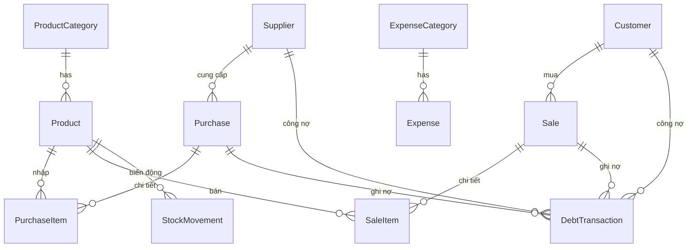

# Tổng quan dự án ANKHANG POS

Ứng dụng **quản lý bán hàng** cho cửa hàng gạo & nước **An Khang** — xây dựng bằng Next.js 14 + TypeScript + Prisma + PostgreSQL.

## Tech Stack

| Thành phần | Công nghệ |
|---|---|
| Frontend | Next.js 14, React 18, TypeScript |
| ORM | Prisma 5 |
| Database | PostgreSQL (Render) |
| Icons | Lucide React |
| Charts | Recharts |
| Styling | Vanilla CSS ([globals.css](file:///home/vanduccongminh/ANKHANG/src/app/globals.css) ~19KB) |

## Cấu trúc thư mục

```
ANKHANG/
├── prisma/
│   ├── schema.prisma      # 11 models, 272 dòng
│   └── seed.ts            # Dữ liệu mặc định
├── src/
│   ├── app/
│   │   ├── api/            # 13 API routes
│   │   ├── layout.tsx      # Root layout + Sidebar
│   │   ├── page.tsx        # Dashboard
│   │   ├── globals.css     # Toàn bộ CSS
│   │   └── [18 page dirs]  # Các trang chức năng
│   ├── components/
│   │   ├── Sidebar.tsx     # Thanh menu trái
│   │   └── Toast.tsx       # Hệ thống thông báo
│   └── lib/
│       ├── prisma.ts       # Prisma client singleton
│       └── utils.ts        # Tiện ích format, tính giá
```

## Database Schema (11 models)



| Model | Mô tả |
|---|---|
| `ProductCategory` | Nhóm sản phẩm (Gạo, Nước, Khác) |
| `Product` | Sản phẩm: mã, tên, giá bán/vốn, tồn kho, barcode |
| `Supplier` | Nhà cung cấp + công nợ phải trả |
| `Customer` | Khách hàng + công nợ phải thu |
| `Purchase` / `PurchaseItem` | Phiếu nhập hàng + chi tiết |
| `Sale` / `SaleItem` | Hóa đơn bán hàng + chi tiết (có giá vốn, giảm giá) |
| `DebtTransaction` | Lịch sử công nợ (cả khách & NCC) |
| `StockMovement` | Biến động kho (nhập/xuất/hủy/điều chỉnh) |
| `ExpenseCategory` / `Expense` | Danh mục & chi phí phát sinh |
| `BackupLog` | Nhật ký sao lưu |
| `SystemSetting` | Cài đặt hệ thống (key-value) |

## Chức năng (18 trang)

### Tổng quan
- **Dashboard** (`/`) — Doanh thu hôm nay, công nợ, cảnh báo tồn kho, đơn hàng gần đây

### Danh mục
- **Sản phẩm** (`/san-pham`) — CRUD sản phẩm
- **Nhà cung cấp** (`/nha-cung-cap`) — CRUD NCC
- **Khách hàng** (`/khach-hang`) — CRUD khách hàng
- **Danh mục chi phí** (`/danh-muc-chi-phi`) — CRUD loại chi phí

### Nghiệp vụ
- **Bán hàng** (`/ban-hang`) — POS bán hàng
- **Lịch sử bán hàng** (`/lich-su-ban-hang`) — Xem/hủy đơn hàng
- **Nhập hàng** (`/nhap-hang`) — Tạo phiếu nhập
- **Công nợ** (`/cong-no`) — Quản lý nợ phải thu/trả
- **Chi phí** (`/chi-phi`) — Ghi nhận chi phí
- **Tồn kho** (`/ton-kho`) — Kiểm tra tồn kho

### Báo cáo
- **Doanh thu** (`/bao-cao/doanh-thu`)
- **Lợi nhuận** (`/bao-cao/loi-nhuan`)
- **Công nợ** (`/bao-cao/cong-no`)
- **Tồn kho** (`/bao-cao/ton-kho`)

### Hệ thống
- **Cài đặt** (`/he-thong/cai-dat`)
- **Sao lưu** (`/he-thong/backup`)
- **Nhật ký** (`/he-thong/nhat-ky`)

## API Routes (13 endpoints)

Tất cả nằm trong `src/app/api/`:

| Route | Chức năng |
|---|---|
| `/api/dashboard` | Dữ liệu tổng quan |
| `/api/products` | CRUD sản phẩm |
| `/api/categories` | CRUD nhóm SP |
| `/api/suppliers` | CRUD NCC |
| `/api/customers` | CRUD khách hàng |
| `/api/purchases` | Phiếu nhập hàng |
| `/api/sales` | Hóa đơn bán hàng |
| `/api/debts` | Giao dịch công nợ |
| `/api/expenses` | Chi phí |
| `/api/expense-categories` | Danh mục chi phí |
| `/api/stock` | Tồn kho |
| `/api/reports` | Báo cáo |
| `/api/settings` | Cài đặt hệ thống |

## Tiện ích (`lib/utils.ts`)

- `formatCurrency()` — Format tiền VND
- `formatNumber()` — Format số theo locale vi-VN
- `formatDate()` / `formatDateTime()` — Format ngày tháng
- `generateCode()` — Sinh mã tự tăng (SP001, HD001...)
- `calculateWeightedAvgCost()` — Tính giá vốn bình quân gia quyền

## Scripts

```bash
npm run dev          # Chạy dev server
npm run build        # Build production
npm run db:push      # Sync schema → database
npm run db:seed      # Tạo dữ liệu mặc định
npm run db:setup     # db:push + db:seed
```
